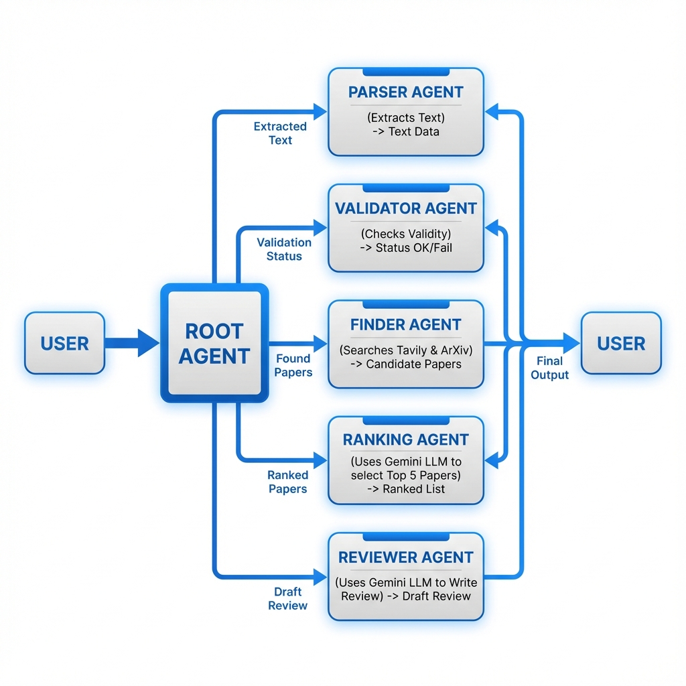
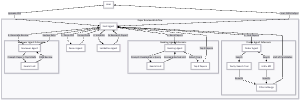
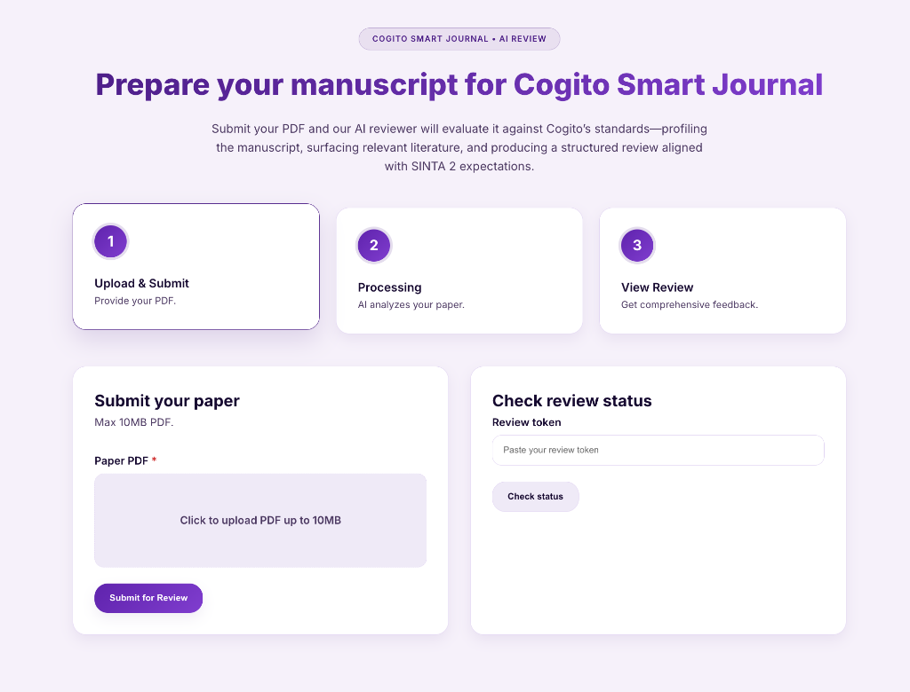
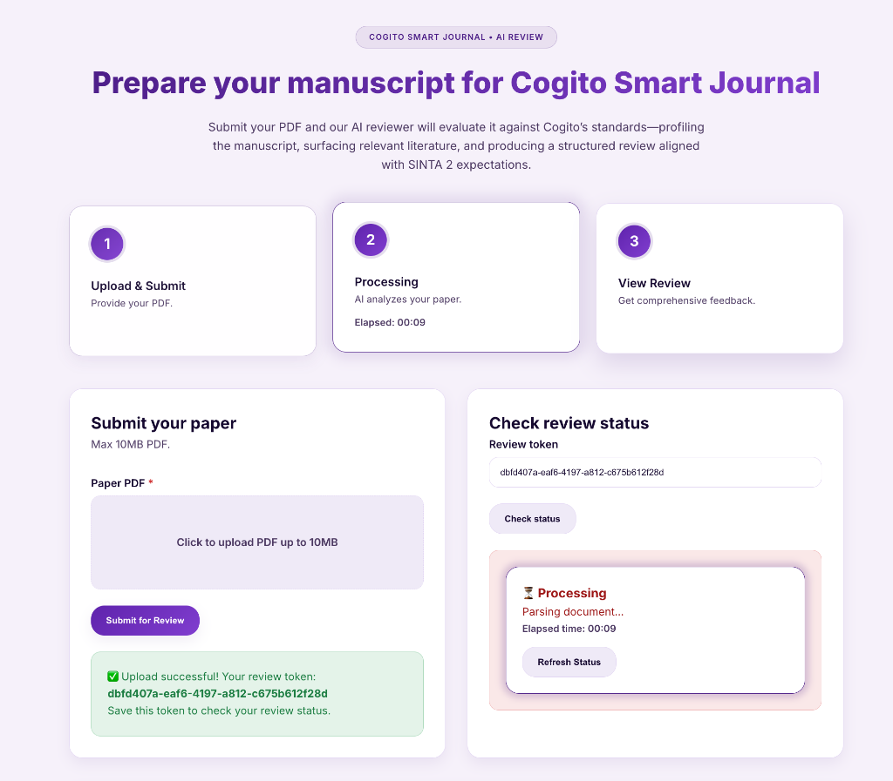
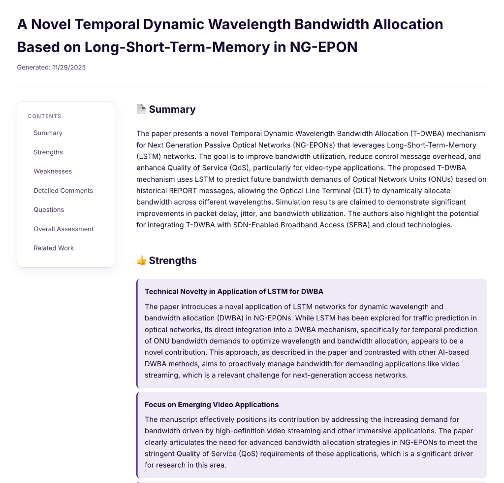

# 🤖 AI Paper Reviewer Agent

An intelligent, multi-agent system designed to automate the academic paper review process. This tool leverages Google's Gemini LLM to parse, validate, research, and review academic manuscripts with human-level depth.



## 🚀 Overview

The **AI Paper Reviewer** is not just a summarizer; it is a full-pipeline research assistant. It treats every uploaded PDF as a submission to a conference, performing a rigorous check against existing literature before generating a structured review.

### Key Capabilities
*   **📄 PDF Parsing**: Converts complex academic PDFs into clean, machine-readable Markdown.
*   **🛡️ Validation**: Automatically detects and rejects non-academic documents (e.g., slides, invoices).
*   **🌍 Deep Search**: Aggregates related work from **Tavily** (Web) and **ArXiv** (Preprints).
*   **🏆 Intelligent Ranking**: Uses **Gemini LLM** to read, score, and select the top 5 most relevant citations.
*   **✍️ Comprehensive Review**: Generates a detailed critique (Strengths, Weaknesses, Questions) comparing the paper to the found references.

---

## 🛠️ How It Works

The system operates as a coordinated team of specialized agents, orchestrated by a **Root Agent**.

### The Agent Workflow
1.  **User Upload**: You upload a PDF via the web interface.
2.  **Parser Agent**: 
    *   Uses `MarkItDown` to extract text.
    *   Uses LLM to extract structured metadata (Title, Abstract, Authors).
3.  **Validator Agent**: 
    *   Analyzes the text to confirm it is a research paper.
    *   Checks for academic structure (Abstract, Intro, References).
4.  **Finder Agent**: 
    *   Generates search queries based on the paper's content.
    *   Queries **Tavily** and **ArXiv** APIs.
    *   Filters results for academic domains (IEEE, ACM, Springer, etc.).
5.  **Ranking Agent**: 
    *   **CRITICAL STEP**: Feeds the list of found papers to **Gemini LLM**.
    *   The LLM evaluates each paper for **Relevance** and **Quality**.
    *   Selects the **Top 5** papers to serve as the "Ground Truth" for the review.
6.  **Reviewer Agent**: 
    *   Reads the uploaded paper + the Top 5 Ranked Papers.
    *   Writes a structured review analyzing Novelty, Methodology, and Correctness.
7.  **Output**: The final JSON result is displayed on the frontend.

### Reviewer Agent Architecture
The following diagram shows the detailed internal architecture of the Reviewer Agent and its interaction with other system components:



---

## � Installation

### Prerequisites
*   Python 3.10 or higher
*   A **Google Cloud** API Key (for Gemini models)
*   A **Tavily** API Key (for web search)

### 1. Clone the Repository
```bash
git clone <your-repo-url>
cd paper_reviewer
```

### 2. Set Up Virtual Environment
```bash
python3 -m venv venv
source venv/bin/activate  # On Windows: venv\Scripts\activate
```

### 3. Install Dependencies
```bash
pip install -r requirements.txt
```

### 4. Configure Environment Variables
Create a `.env` file in the root directory:
```bash
cp .env.example .env
```
Edit `.env` and add your keys:
```env
GOOGLE_API_KEY=your_google_gemini_key_here
TAVILY_API_KEY=your_tavily_api_key_here
```

---

## � Usage

### Start the Application
```bash
python app.py
```
The server will start at `http://localhost:5000`.

### Running a Review
1.  Open your browser to `http://localhost:5000`.
2.  Click **"Upload Paper"** and select a PDF.
3.  Watch the real-time progress log as agents collaborate.
4.  View the final structured review and the list of related papers found.

### Interface Preview




### CLI Testing
You can also run the full pipeline from the command line without starting the web server:
```bash
python test_workflow.py
```
This script will prompt you for a PDF path and display the live agent logs in your terminal.

---

## � Project Structure

```
paper_reviewer/
├── agents/                 # The Brains (Agent Logic)
│   ├── root_agent.py       # Orchestrator
│   ├── parser_agent.py     # PDF -> Text
│   ├── validator_agent.py  # Is this a paper?
│   ├── finder_agent.py     # Search Tools (Tavily/ArXiv)
│   ├── ranking_agent.py    # LLM Ranking Logic
│   └── reviewer_agent.py   # Final Review Generator
├── assets/                 # Images and static assets
├── reviews/                # JSON output of completed reviews
├── uploads/                # Temp storage for uploaded PDFs
├── templates/              # HTML Frontend
├── app.py                  # Flask Web Server
├── requirements.txt        # Python Dependencies
└── README.md               # You are here
```

## 🤝 Contributing
Pull requests are welcome. For major changes, please open an issue first to discuss what you would like to change.

## 📄 License
[MIT](https://choosealicense.com/licenses/mit/)
